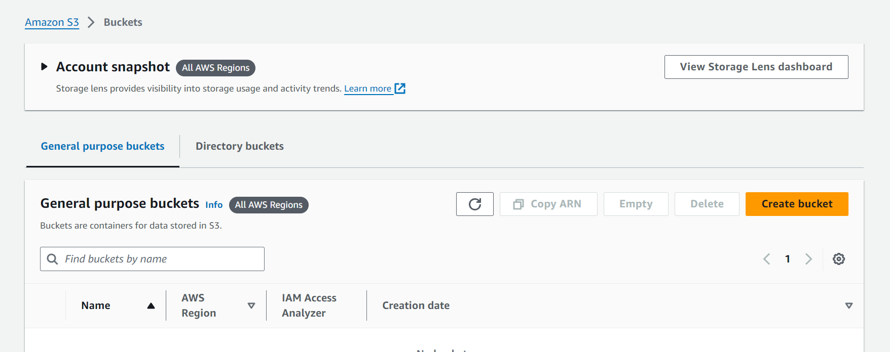
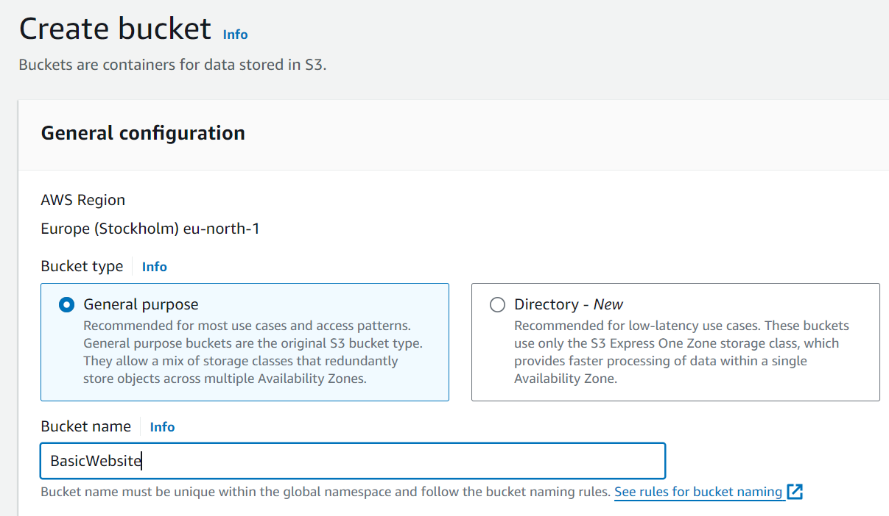
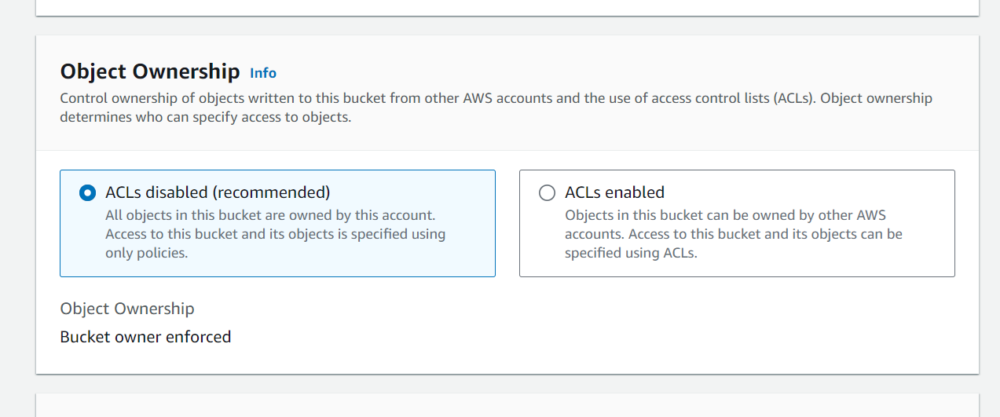
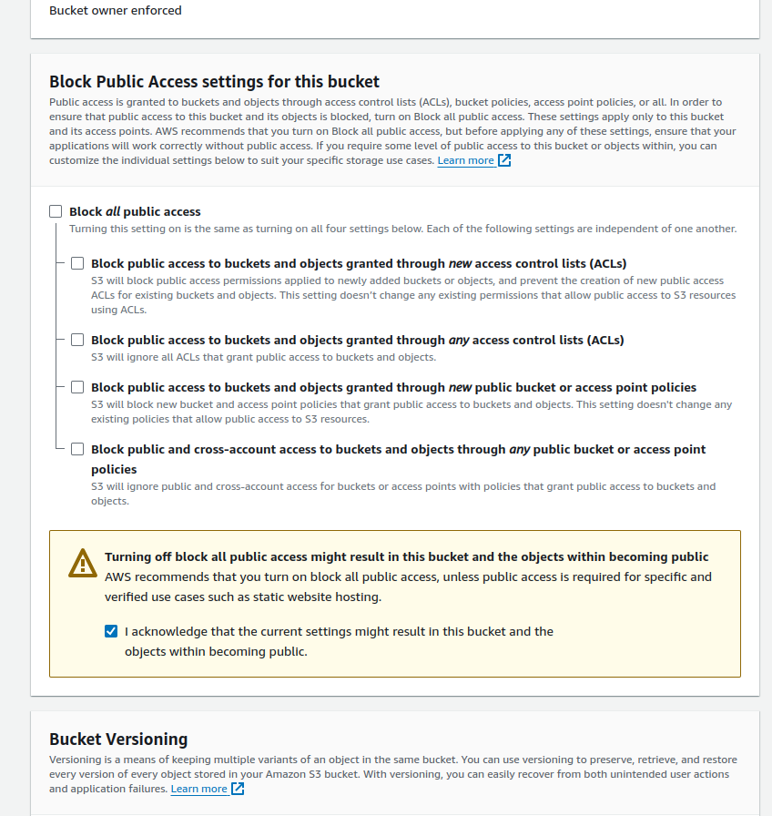
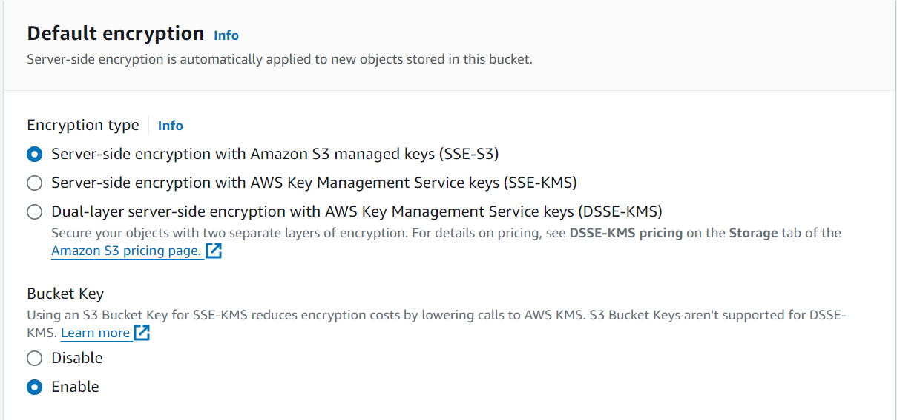
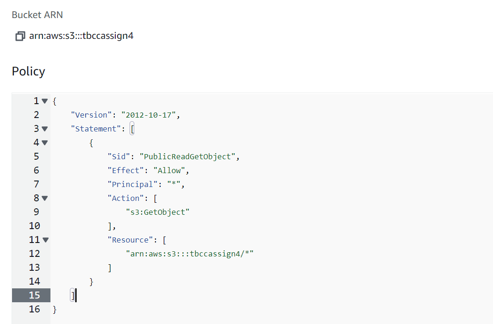
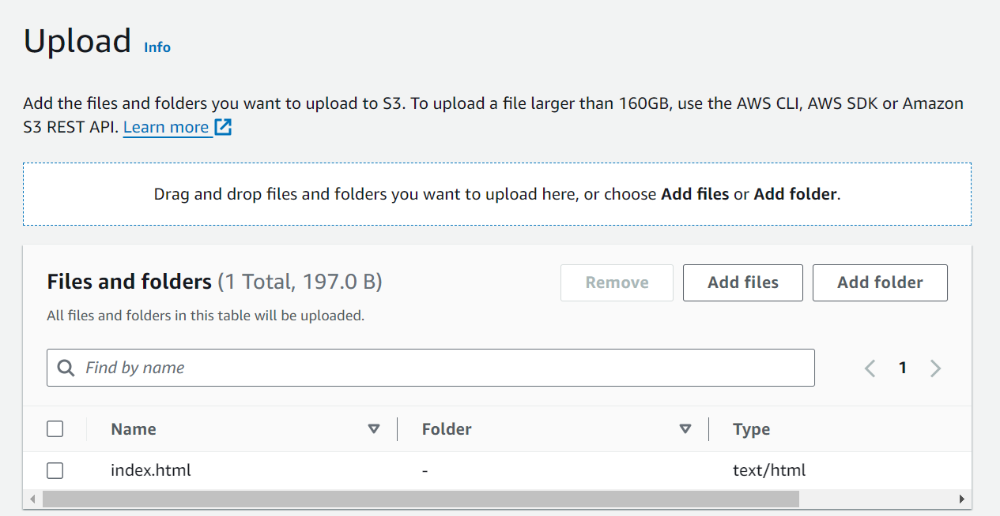
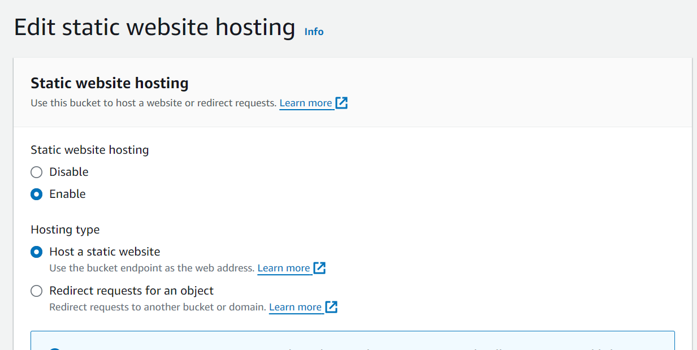
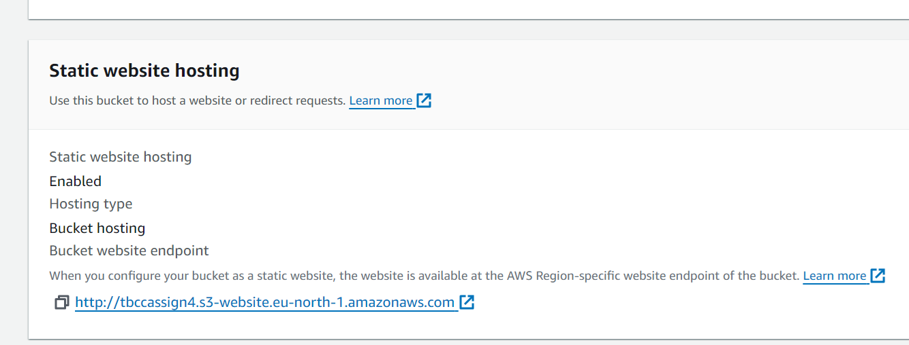
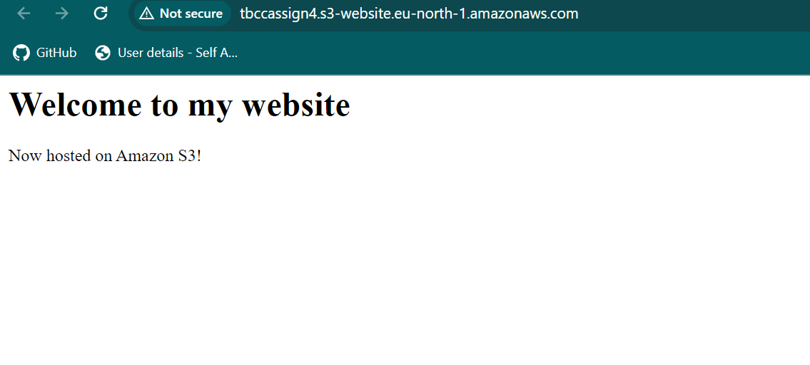

# 4. Deploy static Web application using AWS S3 service

| Name        | Hrishikesh Mahajan   |
| ----------- | -------------------- |
| PRN         | 22110292             |
| Roll Number | 321041               |
| Department  | Computer Engineering |
| Class       | Third Year           |
| Division    | A                    |
| Batch       | A2                   |

## Aim

To gain practical experience in hosting a web application on an Amazon Web Services (AWS) cloud platform. How to create and configure an S3 bucket to host a web application, how to deploy the application, and how to secure the bucket and its contents.

## Theory

Amazon S3 is an ideal platform for hosting static websites. It provides a simple and cost-effective way to store and serve web content, including HTML, CSS, JavaScript, images, and other assets. By using S3, you can take advantage of AWS's global infrastructure, scalability, and durability to host your website with high availability and low latency.

## Amazon Simple Storage Service (Amazon S3) Overview

Amazon Simple Storage Service (Amazon S3) is a scalable object storage service provided by [Amazon Web Services (AWS)](https://aws.amazon.com/s3/). It is designed to store and retrieve any amount of data from anywhere on the web, making it highly versatile and widely used for various storage needs.

A static website is a website that consists of fixed files, such as HTML, CSS, and JavaScript, that are served to users as they are without any server-side processing.

Amazon S3 supports static websites by allowing you to host your static website files directly in an S3 bucket. You can configure the bucket to act as a static website by enabling static website hosting. S3 then serves the files to users over the internet, making it a cost-effective and scalable solution for hosting static websites.

## Features and Benefits

1. **Object-based storage:** Amazon S3 stores data as objects within buckets. An object consists of data, metadata (attributes or properties associated with the object), and a unique identifier. Each object is stored as a file and can range in size from a few bytes to terabytes.
2. **Scalability and durability:** Amazon S3 is designed to provide high scalability and durability for storing data. It can seamlessly scale to accommodate large volumes of data and handle a virtually unlimited number of objects. S3 stores data redundantly across multiple facilities and devices within a region to ensure high durability and availability.
3. **Data availability and accessibility:** S3 provides high availability and low latency for accessing stored data. Objects stored in S3 are accessible over the internet via unique URLs, making it easy to retrieve data from anywhere with an internet connection. S3 supports a variety of access methods, including RESTful APIs, SDKs for popular programming languages, and web-based management consoles.
4. **Security and compliance:** Amazon S3 offers robust security features to protect stored data and control access to it. Users can configure access policies and permissions to restrict who can access, upload, download, or modify objects within buckets. S3 also supports server-side encryption to encrypt data at rest, as well as SSL/TLS encryption for secure data transfer over the internet. Additionally, S3 integrates with [AWS Identity and Access Management (IAM)](https://aws.amazon.com/iam/) for fine-grained access control.
5. **Data management and lifecycle policies:** S3 provides features for managing and organizing data stored in buckets. Users can create lifecycle policies to automatically transition objects between different storage classes (e.g., from Standard to Infrequent Access or Glacier) based on predefined rules such as object age or access frequency. This helps optimize storage costs by moving less frequently accessed data to lower-cost storage tiers.
6. **Versioning and data protection:** Amazon S3 supports versioning, allowing users to keep multiple versions of objects in a bucket. This helps protect against accidental deletion or modification of data by enabling users to restore previous versions of objects if needed. S3 also provides features for logging and monitoring bucket activity, enabling users to track access, changes, and usage of stored data.
7. **Integration with AWS ecosystem:** Amazon S3 integrates seamlessly with other AWS services and solutions, making it a foundational component of many cloud-based applications and workflows. It can be used in conjunction with services such as [AWS Lambda](https://aws.amazon.com/lambda/), [Amazon CloudFront](https://aws.amazon.com/cloudfront/), [Amazon Athena](https://aws.amazon.com/athena/), [Amazon EMR](https://aws.amazon.com/emr/), and more to build scalable, cost-effective, and reliable solutions for data storage, processing, analytics, and content delivery.

## Implementation Steps

1. **Create an S3 bucket:** Log in to the AWS Management Console and navigate to the S3 service. Click on "Create bucket" and provide a unique name for your bucket. Select the appropriate AWS Region and click "Create bucket". Configure the bucket settings as needed, including object ownership, public access settings, and encryption options.

   
   
   
2. **Grant public access:** To make the website accessible to the audience, we need to grant public access to the objects in this S3 bucket. Follow these steps:
    - Go to the properties tab of the S3 bucket.
    - Scroll down to the "Block Public Access" section.
    - Uncheck the "Block all public access" checkbox.
    - Click on Save Changes to apply the modifications.

    
    
3. **Set bucket policy:** In the S3 console, select your bucket and navigate to the "Permissions" tab. Click on "Bucket Policy" and add the following policy to grant read-only access to the public:

   ```json
   {
       "Version": "2012-10-17",
       "Statement": [
           {
               "Sid": "PublicReadGetObject",
               "Effect": "Allow",
               "Principal": "*",,
               "Action": [
                   "s3:GetObject"
               ],
               "Resource": [
                   "arn:aws:s3:::your-bucket-name/*"
               ]
           }
       ]
   }
   ```

   
4. **Upload necessary files:** Use the AWS CLI or the S3 console to upload your website files to the S3 bucket. You can upload individual files or entire directories as needed. Make sure to include the index document (e.g., index.html) and any other assets (e.g., CSS, JavaScript, images) required for your website to function correctly.
   
5. **Configure static website hosting:** In the S3 console, select your bucket and navigate to the "Properties" tab. Click on "Static website hosting" and choose "Use this bucket to host a website". Enter the index document and error document (if applicable) and save the configuration.
   
6. **Access the website:** Find the endpoint URL provided in the static website hosting configuration. Open the URL in a web browser to access your static website hosted on Amazon S3.
   
7. **Test the website:** Access the website URL you found in the previous step to test the hosted static website. Ensure that all files are loading correctly and the website functions as expected.
   
8. **Enable HTTPS (optional):** To enable HTTPS for your static website hosted on S3, you can use [Amazon CloudFront](https://aws.amazon.com/cloudfront/) as a content delivery network (CDN) in front of your S3 bucket. CloudFront provides SSL/TLS termination and can serve your website over HTTPS.

## Conclusion

In this activity, we learned how to host a static website on Amazon S3 by creating an S3 bucket, uploading website files, configuring static website hosting, setting bucket policies for public access, and accessing the website via the S3 endpoint URL. Amazon S3 provides a cost-effective and scalable solution for hosting static websites with high availability, durability, and security features. By following the steps outlined in this activity, you can easily deploy your static website on Amazon S3 and make it accessible to a global audience over the internet.
