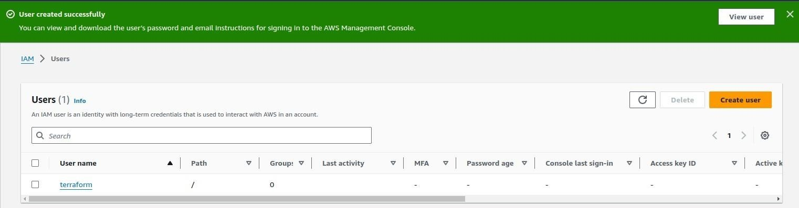
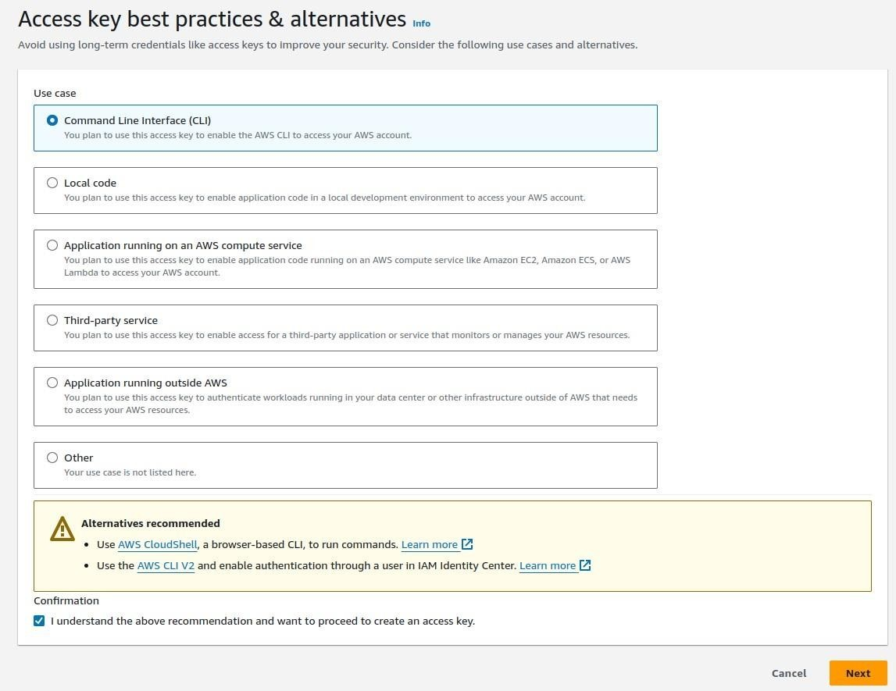
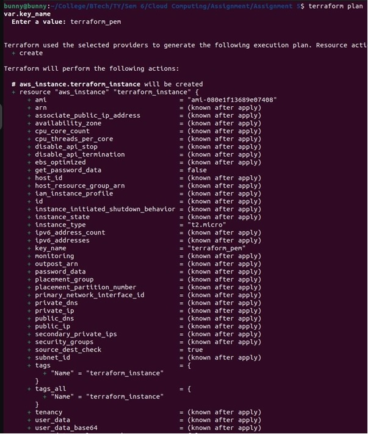

# 5. Create an EC2 instance on AWS using IaC with Terraform

| Name        | Hrishikesh Mahajan   |
| ----------- | -------------------- |
| PRN         | 22110292             |
| Roll Number | 321041               |
| Department  | Computer Engineering |
| Class       | Third Year           |
| Division    | A                    |
| Batch       | A2                   |

## Title

Write IaC using Terraform to create an EC2 machine on AWS, Azure, or Google Cloud. (Compulsory to use Input and output variable files)

## Aim

Writing Infrastructure as Code (IaC) using Terraform to create an EC2 machine on a cloud platform such as AWS, Azure, or Google Cloud is to help students gain practical experience in using Terraform to provision infrastructure resources.

## Theory

[Terraform](https://www.terraform.io/) is an open-source Infrastructure as Code (IaC) tool developed by [HashiCorp](https://www.hashicorp.com/). It allows users to define and provision data center infrastructure using a declarative configuration language. In simpler terms, Terraform enables you to manage your infrastructure by writing code rather than manually configuring resources.

### Infrastructure as Code (IaC)

Terraform follows the principle of Infrastructure as Code, which means infrastructure is managed using code rather than through manual processes or interactive configuration tools. With Terraform, you define the desired state of your infrastructure in code, and Terraform takes care of provisioning and managing the actual resources to match that state.

### Declarative Configuration Language

Terraform uses its configuration language called HashiCorp Configuration Language ([HCL](https://www.terraform.io/docs/language/syntax/configuration.html)) to define infrastructure components and their relationships. HCL is a human-readable language designed specifically for defining infrastructure configurations. It allows you to specify the desired state of various resources, such as virtual machines, networks, storage, and more.

### Providers

Terraform uses providers to interact with different cloud providers, infrastructure platforms, and services. Providers are responsible for understanding API interactions and exposing resources that Terraform can manage. For example, there are providers for [Amazon Web Services (AWS)](https://registry.terraform.io/providers/hashicorp/aws/latest), [Microsoft Azure](https://registry.terraform.io/providers/hashicorp/azurerm/latest), [Google Cloud Platform (GCP)](https://registry.terraform.io/providers/hashicorp/google/latest), [VMware](https://registry.terraform.io/providers/hashicorp/vsphere/latest), and many others. Each provider offers a set of resources that can be managed using Terraform.

### Terraform Configuration Files

Terraform configurations are defined in files with a `.tf` extension. These files contain the infrastructure code written in HCL. A Terraform configuration typically includes resource definitions, variable declarations, and any other necessary configuration settings. You can organize your configurations into multiple files and directories for better maintainability.

### State Management

Terraform maintains a state file that keeps track of the current state of your infrastructure. This state file is used to map the relationships between your configuration and the real-world resources provisioned by Terraform. It also helps Terraform determine what changes need to be applied to reach the desired state. The state file can be stored locally or remotely, depending on your configuration.

### Execution Plan

When you run Terraform commands, such as `terraform plan` or `terraform apply`, Terraform generates an execution plan based on the current state of your infrastructure and the changes defined in your configuration. The execution plan outlines what actions Terraform will take to create, update, or delete resources to reach the desired state.

### Apply Changes

Once you review and approve the execution plan, you can apply the changes by running `terraform apply`. Terraform will then execute the planned actions, provisioning or modifying resources as necessary. During this process, Terraform communicates with the respective providers' APIs to create, update, or delete resources according to the configuration.

### Version Control Integration

Terraform configurations can be versioned using version control systems like Git. This allows teams to collaborate on infrastructure changes, track modifications over time, and revert to previous versions if needed. Terraform configurations are typically stored alongside application code, enabling infrastructure changes to be managed in parallel with application development.

## Implementation

Step 1: Download and install Terraform from the official website: [Terraform Downloads](https://www.terraform.io/downloads.html).


Verify Installation


Step 2: Add the AWS provider configuration in the `main.tf` file using the `provider` block. You can find the documentation for AWS provider configuration [here](https://registry.terraform.io/providers/hashicorp/aws/latest/docs).


Step 3: Create an IAM user with Administrator access in the AWS Management Console. Follow the official AWS documentation on [Creating IAM Users](https://docs.aws.amazon.com/IAM/latest/UserGuide/id_users_create.html).




Step 4: Create an access key for the IAM user you created in the previous step. Go to the IAM section in the AWS Management Console, select the user, and then navigate to the Security Credentials tab. Click on Create Access Key.




Step 5: Configure AWS CLI on your local system with the access key and secret key obtained in the previous step using the command `aws configure`. You can find detailed instructions in the [AWS CLI Configuration Guide](https://docs.aws.amazon.com/cli/latest/userguide/cli-configure-quickstart.html)


Step 6: Configure the Terraform file (`main.tf`) to generate the PEM file required for SSH access to the EC2 instance. You can use the `tls_private_key` resource in Terraform. Refer to the [Terraform TLS Provider documentation](https://registry.terraform.io/providers/hashicorp/tls/latest/docs/resources/private_key) for guidance.


Step 7: Create a key pair in AWS EC2 Console or using AWS CLI. Refer to the AWS documentation on [Creating a Key Pair Using Amazon EC2](https://docs.aws.amazon.com/AWSEC2/latest/UserGuide/ec2-key-pairs.html).


Step 8: Save the private key generated in the previous step on your local system. Ensure that the file permissions are set securely (`chmod 400 <private_key_file>`).


Step 9: Define an EC2 instance resource in your Terraform configuration (`main.tf`). You can refer to the [Terraform AWS Instance documentation](https://registry.terraform.io/providers/hashicorp/aws/latest/docs/resources/instance) for assistance.


Step 10: Initialise Terraform in your project directory using the command `terraform init` and then apply the configuration using `terraform apply`. This will start the EC2 instance as per the defined configuration.




This will create an EC2 instance and can be checked in the EC2 dashboard.


You can also connect to this instance using SSH and the PEM file created.


## Terraform Code

Each Terraform configuration must be in its working directory. Create a directory for your configuration.

in that directory create a `main.tf` file
In this file, we can see `var` being used. This is for input variables. In the same directory create another `variables.tf` file

```terraform
variable "instance_name" {
  description = "Value of the Name tag for the EC2 instance"
  type        = string
  default     = "EC2_using_Terraform"
}

variable "instance_ami_id" {
    description = "Amazon machine image id"
    type = string
    default ="ami-0914547665e6a707c"
}

variable "instance_type" {
    description = "EC2 instance type"
    type = string
    default = "t3.micro"
}
```

Here we have created a few variables `instance_id`, `instance_name`, `instance_ami_id`, `instance_type`. These variables are later used in `main.tf` file. Input variables are useful as they make terraform code modular and increase the readability of our code.

To get outputs from terraform we use `outputs.tf` file

```terraform
output "instance_id" {
  description = "ID of the EC2 instance"
  value       = aws_instance.app_server.id
}

output "instance_public_ip" {
  description = "Public IP address of the EC2 instance"
  value       = aws_instance.app_server.public_ip
}

```

## Conclusion

Learn to write Terraform code to create and configure an EC2 instance, use input and output variables to customize the deployment, and validate the deployment by accessing the instance. By completing this assignment successfully, students can gain valuable experience that will prepare them for real-world scenarios where IaC is used to provision infrastructure resources in cloud environments.
