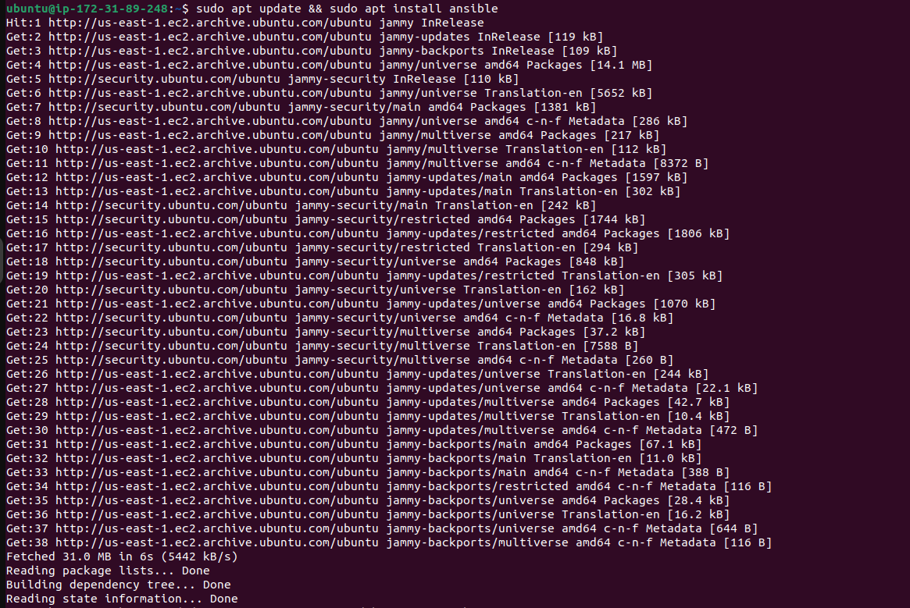
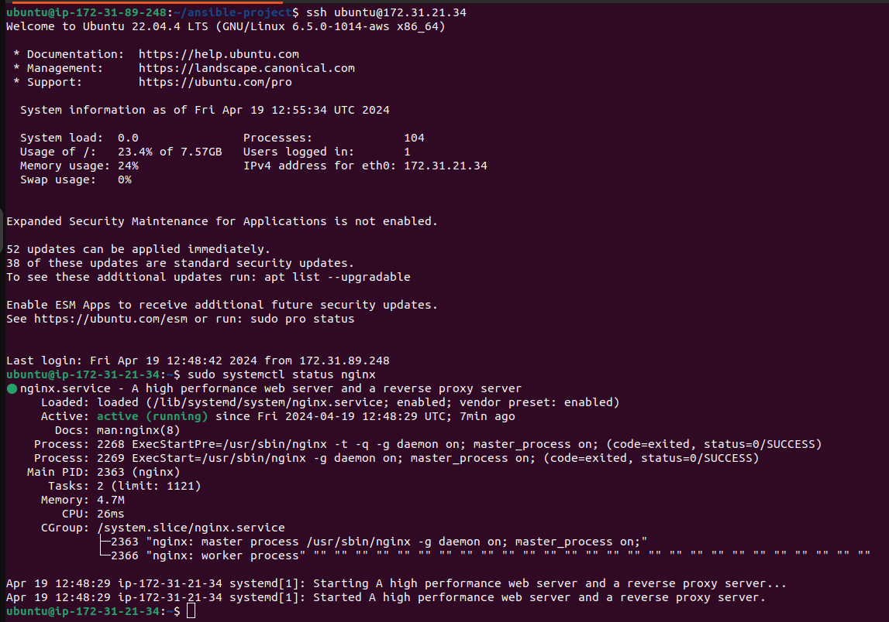
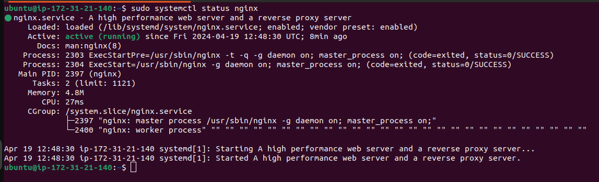

# 6. Write an ansible-playbook to install nginx on target servers

| Name        | Hrishikesh Mahajan   |
| ----------- | -------------------- |
| PRN         | 22110292             |
| Roll Number | 321041               |
| Department  | Computer Engineering |
| Class       | Third Year           |
| Division    | A                    |
| Batch       | A2                   |

## Theory

### YAML


YAML (YAML Ain't Markup Language) is a human-readable data serialization language that is commonly used for configuration files and in applications where data is being stored or transmitted.

Here are some key things to know about YAML:

- YAML uses spaces, tabs, and newlines to structure data. Indentation is used to indicate nesting and hierarchy.

- Data is represented as key-value pairs. The key and value are separated by a colon, and each pair is on a separate line.

```yaml
key: value
```

- Lists are denoted by a hyphen `-` before each item:

```yaml
- Item 1
- Item 2
```

- Comments begin with a `#` symbol.

- YAML supports data types like numbers, strings, booleans, null, arrays, and objects.

For more details, see the [official YAML documentation](https://yaml.org).

### Ansible


Ansible is an open-source automation tool that can configure systems, deploy software, and orchestrate more advanced IT tasks such as continuous deployments or zero downtime rolling updates.

Key features of Ansible:

- Agentless - Uses SSH to connect to managed nodes, no agents are required
- Idempotent - Won't run tasks that have already been completed
- Playbooks - YAML files that define automation tasks
- Roles - Reusable sets of tasks/configurations organized into roles
- Modules - Extend Ansible functionality, written in Python
- Ansible Galaxy - Shared roles developed by the community
- Ansible Tower - Web UI, REST API, enterprise features

Ansible is a simple yet powerful automation tool for application deployment, configuration management, and orchestration.


## Implementation

Step 1: Create EC2 instances

- Follow the instructions in the [Amazon EC2 documentation](https://docs.aws.amazon.com/AWSEC2/latest/UserGuide/EC2_GetStarted.html) to create EC2 instances.


Step 2: Connect to the “Ansible-Master” server

- Use SSH to connect to the "Ansible-Master" server. Use the following command.

```bash
ssh -i <path_to_private_key> username@ansible-master-ip
```


Step 3: Update and install Ansible on the master server

- Run `sudo apt update` followed by `sudo apt install ansible` on the Ansible-Master server.




Step 4: Connect to the remaining servers (Ansible-Server1 to Ansible-Server4)

- Use SSH to connect to each remaining server individually using their respective IP addresses.


Step 5: Update all the servers

- Run `sudo apt update && sudo apt upgrade -y` on each server to update them.


Step 6: Generate ssh-key on Ansible-Master server

- Run `ssh-keygen` on the Ansible-Master server to generate an SSH key pair.


Step 7: Add the public key of Ansible-Master in all other servers' “authorized_keys” directory

- Run `ssh-copy-id username@server-ip` on the Ansible-Master server for each remaining server.


Step 8: Create a playbook on Ansible-Master

   1. Add private IP addresses of Ansible servers in the inventory file
      - Edit the Ansible inventory file located at `/etc/ansible/hosts` and add the private IP addresses of Ansible servers.

      

      

   2. Write the playbook in YAML
      - Create a YAML file for the playbook, e.g., `nginx_install.yml`, and define tasks to install nginx on all servers.

      

   3. Execute the playbook
      - Run `ansible-playbook nginx_install.yml` on the Ansible-Master server to execute the playbook.

      

Step 9: Verify the installation and running status

- Use SSH to connect each Ansible-Server1 to Ansible-Server4 individually and verify that nginx is installed and running.






## Conclusion

We have successfully installed Nginx on all the servers. This playbook can be extended to include additional tasks for configuration management, application deployment, and other automation tasks.
