# 7. Deploy a web application using Docker

| Name        | Hrishikesh Mahajan   |
| ----------- | -------------------- |
| PRN         | 22110292             |
| Roll Number | 321041               |
| Department  | Computer Engineering |
| Class       | Third Year           |
| Division    | A                    |
| Batch       | A2                   |

## Aim

Deploy a web application using Docker

## Theory

### 1. What is Docker

Docker is a platform for developing, shipping, and running applications
in containers. Containers allow developers to package an application
with all its dependencies into a standardized unit for easy deployment
across different environments.

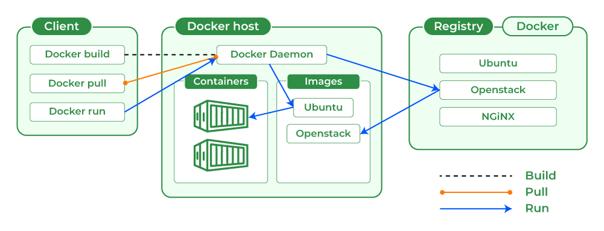

### 2. Docker Architecture

Docker architecture consists of three main components:

- **Docker Engine**: The runtime that runs and manages containers on
  a host system.

- **Docker Images**: Lightweight, standalone, executable packages
  that contain everything needed to run a piece of software, including
  the code, runtime, libraries, and dependencies.

- **Docker Registries**: Repositories for Docker images, allowing
  users to store and share container images.

### 3. Difference between Docker and Virtual Machine

- Docker containers share the host OS kernel, making them more
  lightweight and efficient compared to virtual machines.

- Virtual machines emulate full hardware, including the OS, while Docker
  containers only virtualize the application and its dependencies.

- Docker containers start much faster than virtual machines since they
  don't need to boot an entire OS.

### 4. Docker Commands

- `docker run` Create and start a container.

- `docker build` Build an image from a Dockerfile.

- `docker pull` Pull an image or a repository from a registry.

- `docker push` Push an image or a repository to a registry.

- `docker ps` List running containers.

- `docker stop` Stop one or more running containers.

- `docker rm` Remove one or more containers.

- `docker rmi` Remove one or more images

### 5. Dockerfile

A Dockerfile is a text document that contains instructions for building
a Docker image. It specifies the base image to use, any additional
dependencies to install, and commands to run when the container starts.

### 6. Docker-Compose and Docker-Swarm

- **Docker-Compose**: A tool for defining and running
  multi-container Docker applications. It uses a YAML file to configure
  the application's services, networks, and volumes, making it easy to
  manage complex applications.

- **Docker-Swarm**: A native clustering and orchestration tool for
  Docker. It allows users to create and manage a cluster of Docker
  nodes, providing features like service discovery, load balancing, and
  rolling updates for containerized applications.

## Implementation

**Step 1**: Install Docker

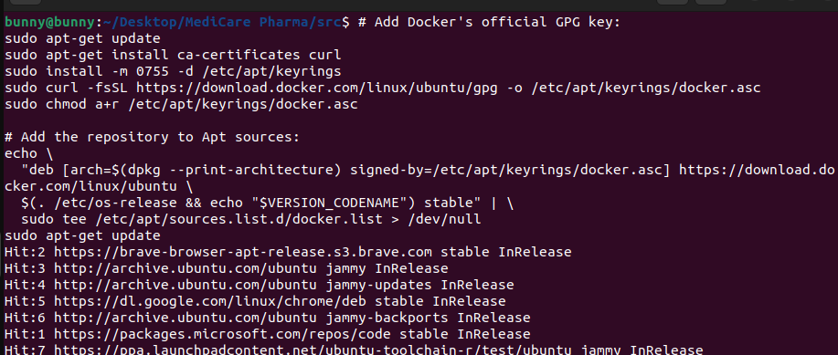

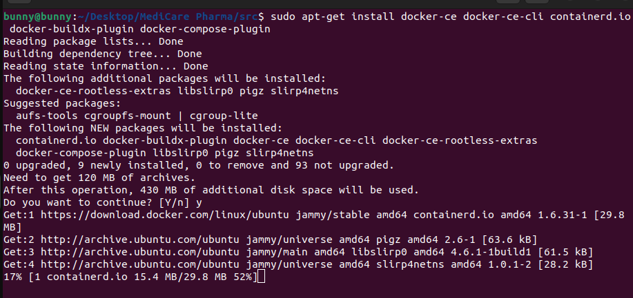

**Step 2**: Check the installation by running the hello-world image

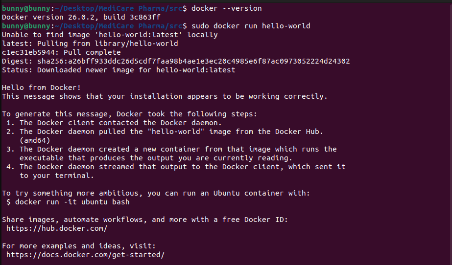

**Step 3**: Create a docker file for the application (This
application uses Ubuntu OS, PHP server, and MySQL database)

a\) Use the Ubuntu OS for the application

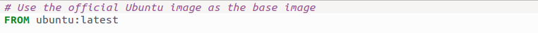

b\) Set the working directory and copy the required files to the
corresponding directory

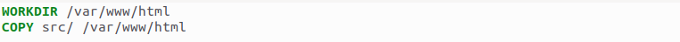

c\) Update Ubuntu and install the required packages for the application

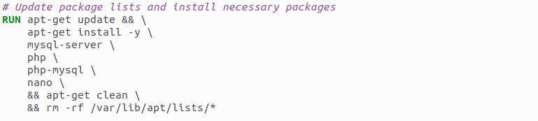

d\) Set environment variables for SQL database

 Expose port and change the ownership to www-data

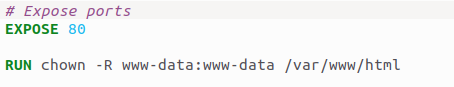

g\) Start the required services

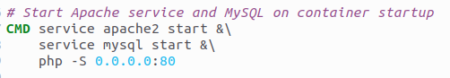

**Step 4**: Build the docker image

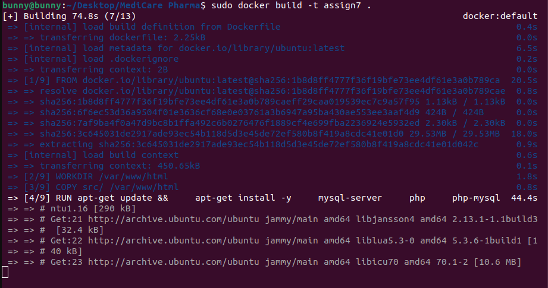
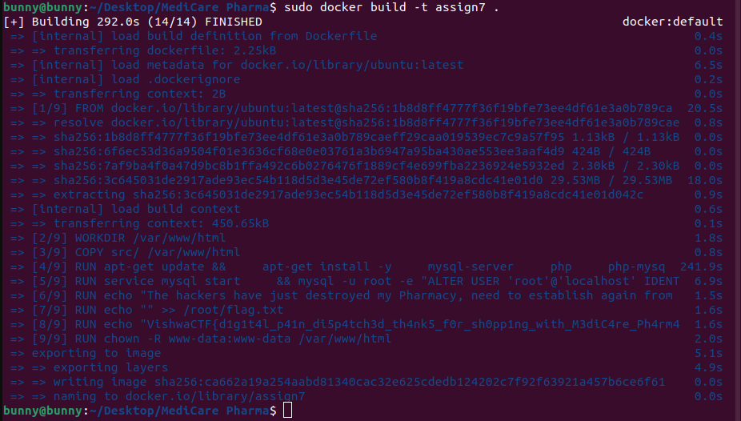

**Step 5**: Run the image locally

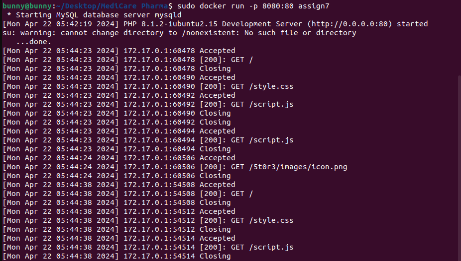

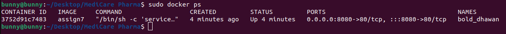

**Step 6**: Login to docker

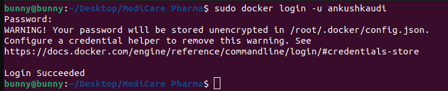

**Step 7**: Tag the image with a new name

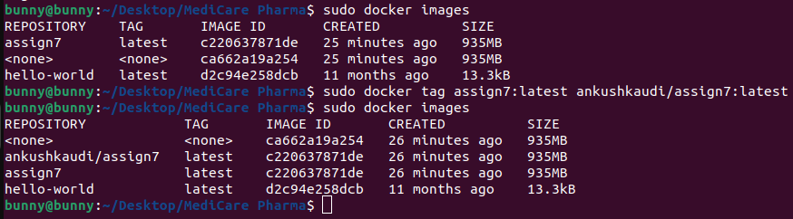

**Step 8**: Push the image to the docker hub

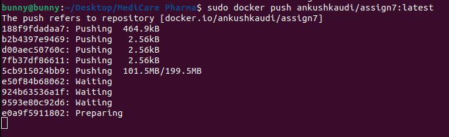

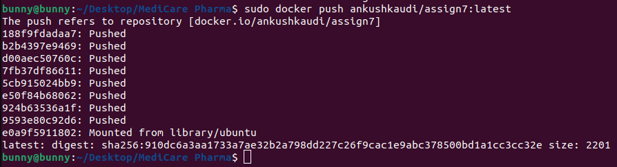

**Step 9**: Verify from the docker hub if images were successfully pushed

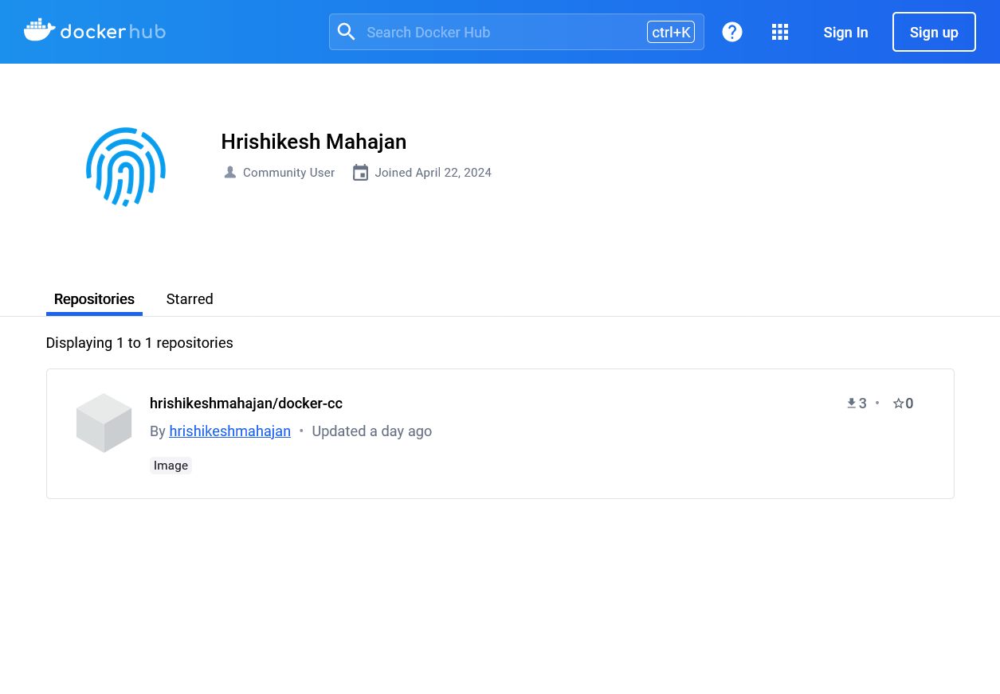

Now, this image is public and can be pulled by anyone.

## Conclusion

Thus, deploying a web application on docker has proved to be a straightforward process. By containerizing the application and its dependencies, we achieved portability and consistency across different environments. Docker's ease of use and robust features enabled seamless deployment, scaling, and management of the application.
