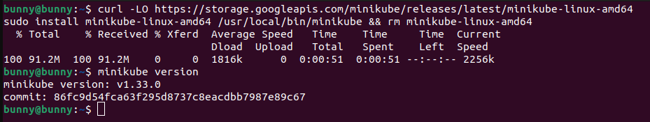
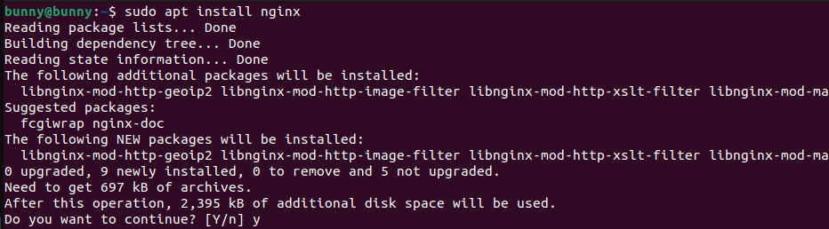

# 8. Deploy a Web app using Kubernetes

| Name        | Hrishikesh Mahajan   |
| ----------- | -------------------- |
| PRN         | 22110292             |
| Roll Number | 321041               |
| Department  | Computer Engineering |
| Class       | Third Year           |
| Division    | A                    |
| Batch       | A2                   |

## Aim

Setup Single Node Kubernetes Cluster with Minikube and
Deploy a web app on a Kubernetes cluster

## Theory

### What is Kubernetes

Kubernetes is an open-source container orchestration platform originally
developed by Google and now maintained by the Cloud Native Computing
Foundation (CNCF). It automates the deployment, scaling, and management
of containerized applications. With Kubernetes, you can deploy your
applications in containers (like Docker containers) and efficiently
manage those containers at scale.

Kubernetes provides a platform-agnostic framework, allowing you to run
your applications on any infrastructure, be it on-premises, in the
cloud, or a hybrid of both. It abstracts away the underlying
infrastructure complexities and provides a consistent interface for
deploying and managing containerized applications.

#### What is the need for Kubernetes

Kubernetes addresses several challenges associated with deploying and
managing containerized applications at scale. Some of the key needs that
Kubernetes fulfills include:

- **Orchestration**: Kubernetes automates the deployment, scaling,
  and management of containerized applications, freeing developers from
  manual intervention.

- **Scalability**: It enables you to easily scale your applications
  up or down based on demand, ensuring optimal resource utilization.

- **High Availability**: Kubernetes ensures that your applications
  are highly available by automatically restarting failed containers and
  distributing workloads across multiple nodes.

- **Portability**: Kubernetes provides a platform-agnostic
  framework, allowing you to deploy your applications consistently
  across different environments, including on-premises data centers,
  public clouds (like AWS, Azure, or GCP), and hybrid environments.

- **Resource Efficiency**: Kubernetes optimizes resource utilization
  by efficiently scheduling containers onto nodes based on available
  resources and workload requirements.

- **Service Discovery and Load Balancing**: Kubernetes provides
  built-in mechanisms for service discovery and load balancing, making
  it easier to connect and route traffic to your applications.

#### Kubernetes Components

Kubernetes architecture consists of several components, each with
specific roles and responsibilities:

**Master Components**:

- **API Server**: Exposes the Kubernetes API, which allows clients
  to interact with the Kubernetes control plane.

- **Scheduler**: Assigns nodes to newly created pods based on
  resource requirements and constraints.

- **Controller Manager**: Runs controller processes that regulate
  the state of the cluster, such as node and pod replication
  controllers.

- **etcd**: Consistent and highly available key-value store used as
  Kubernetes' backing store for all cluster data.

#### Node Components

- **Kubelet**: An agent that runs on each node and is responsible
  for managing the containers and ensuring they are running as expected.

- **Kube-proxy**: Maintains network rules on nodes, enabling
  communication between pods and external traffic.

- **Container Runtime**: The software responsible for running
  containers, such as Docker, containerd, or CRI-O.

#### Add-ons

- **DNS**: Provides DNS-based service discovery for Kubernetes
  services.

- **Dashboard**: A web-based UI for managing and monitoring
  Kubernetes clusters.

- **Ingress Controller**: Manages external access to services within
  a cluster, typically through HTTP/HTTPS routing.

#### Kubernetes Architecture and Kubernetes Architecture on AWS

The Kubernetes architecture remains consistent regardless of the
underlying infrastructure, but when deploying Kubernetes on AWS, there
are some AWS-specific considerations:

- **Networking**: Kubernetes on AWS typically uses Amazon Virtual
  Private Cloud (VPC) for networking. You might utilize AWS Elastic Load
  Balancers (ELB) or the AWS Network Load Balancer (NLB) for load
  balancing traffic to Kubernetes services.

- **Storage**: AWS offers various storage options for Kubernetes,
  such as Amazon Elastic Block Store (EBS) for persistent block storage
  and Amazon Elastic File System (EFS) for shared file storage.

- **Compute**: Kubernetes clusters on AWS run on EC2 instances,
  which provide the underlying compute resources. AWS Auto Scaling
  groups can be utilized for managing the scaling of worker nodes in the
  cluster.

- **IAM**: Kubernetes on AWS leverages AWS Identity and Access
  Management (IAM) for authentication and authorization of users and
  services accessing AWS resources.

- **Integration with AWS Services**: Kubernetes can integrate with
  various AWS services like AWS Identity and Access Management (IAM),
  Amazon Elastic Container Registry (ECR), Amazon Relational Database
  Service (RDS), Amazon Simple Storage Service (S3), etc., for enhanced
  functionality and seamless integration with existing AWS workflows.

#### Kubernetes Architecture on AWS

**Ingress**: Ingress is an API object that manages external access
to services within a Kubernetes cluster. It provides HTTP and HTTPS
routing to services based on hostnames and paths, allowing you to expose
multiple services through a single external endpoint.

- **Routing Traffic**: Ingress acts as a traffic controller,
  directing external requests to the appropriate services within the
  Kubernetes cluster based on the request's hostname and path.

- **Layer 7 Load Balancing**: Ingress operates at Layer 7 of the OSI
  model, enabling it to perform advanced routing and load balancing
  based on HTTP request parameters such as URL paths and headers.

- **Host-based Routing**: Ingress allows you to define rules based
  on hostnames, enabling you to route traffic to different services
  based on the hostname specified in the HTTP request.

- **Path-based Routing**: Ingress also supports routing based on URL
  paths, allowing you to route requests to different services based on
  the path portion of the URL.

- **TLS Termination**: Ingress can terminate TLS (Transport Layer
  Security) connections, allowing you to configure HTTPS endpoints for
  your services. This ensures secure communication between clients and
  services.

- **Integration with Controllers**: Ingress resources are typically
  implemented by Ingress controllers, which are responsible for
  configuring and managing the underlying load balancer (e.g., Nginx,
  HAProxy) to route traffic according to the Ingress rules.

- **Dynamic Configuration**: Ingress allows you to dynamically
  configure routing rules without the need to modify the underlying load
  balancer configuration. This provides flexibility and agility in
  managing traffic patterns.

- **Additional Features**: Some Ingress controllers offer additional
  features such as authentication, rate limiting, and Web Application
  Firewall (WAF) capabilities, enhancing the security and functionality
  of the exposed services.

## Implementation

**Step 1**: Install minikube

Link: [Install Minikube](https://minikube.sigs.k8s.io/docs/start/)

1\. Download the latest release

2\. Validate the binary

3\. Install kubectl and verify installation

4\. Install minikube

**Step 2**: Install nginx

Nginx is running. Now, this would be deployed on Kubernetes.

**Step 3**: Configure Minikube to deploy on Kubernetes

**Step 4**: Access the Minikube dashboard

**Step 5**: Create an application

**Step 6**: Deploy

**Step 7**: Access the application

## Conclusion

 Deploying a web application using Kubernetes
offers unparalleled scalability, reliability, and efficiency. Leveraging
Kubernetes' container orchestration capabilities streamlines deployment
processes, enhances resource utilization, and ensures seamless
management of containerized applications, marking a significant
advancement in modern software deployment methodologies.
